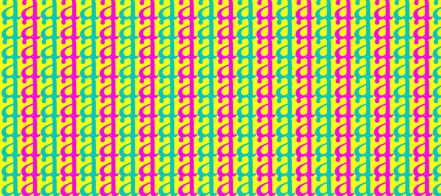

# Typographic Patterns

## 1 dimensional pattern

```js
function setup() {
  createCanvas(600, 200);
  textFont("SansSerif");
  textAlign(CENTER, BASELINE);
  background(200);
}

function draw() {
	textSize(120);
}

function keyPressed() {
  background(200);
  for (var i = 0; i < 40; i++) {
    fill(random(150, 255), 50, 200);
    text(key, -30 + i * 30, height/4*3 );
  }
}
```

*Exercise: How about text size increasing/decreasing inside the for loop? What other things can you control within the loop?*

## 2 dimensional pattern
```js
var t = "";

function setup() {
	createCanvas(600, 600);
	textFont("Serif");
	textSize(96);
}

function draw() {
	background(255, 255, 0);

	for (var i = 0; i <= width; i += 40) {
		for (var j = 0; j <= height; j += 40) {
			if (i % 80 == 0) {
				fill(0, 200, 200);
			}	else {
				fill(250, 0, 250);
			}
			text(t, i, j);
		}
	}
}

function keyTyped() {
	t = key;
}
```

*Exercise: Identify which number controls the spacing between each letter. Then, control the spacing with mouse position. Do note that you may run into an infinite loop when mouse position is at `0`. You must avoid that!*

## Brick pattern
Notice that, for the transformations to happen on each letter, we have to use transformation functions within `push()` and `pop()`.

```js
var scaleFactor;
var t = "g";

function setup() {
  createCanvas(800, 600);
	textFont("Serif");
	textAlign(CENTER, CENTER);
}

function draw() {
  background(255);

  var xspacing = 60;
  var yspacing = 40;
  scaleFactor = map(mouseX, 0, width, 0.2, 4);
  var xcount = 0;
  var ycount = 0;
  
  for (var y = 0; y <= height; y += yspacing) {
    for (var x = 0; x <= width; x += xspacing) {
      push();
      // every other row
      if (ycount % 2 == 0) {
        translate(x, y);
        rotate(frameCount/200.0);
      } else {
        translate(x - xspacing/2, y);
        rotate(-frameCount/200.0);
      }
      if (xcount % 2 == 0) {
				fill(100, 200, 255);
			} else {
				fill(250, 100, 250);
			} 
			textSize(40 * scaleFactor);
      text(t, 0, 0);
      pop();

      xcount++;
    }
    ycount++;
  }
}

function keyTyped() {
	t = key;
}
```

## Circular pattern

```js
var s1 = "꽃";
var s2 = "잎";

function setup() {
  createCanvas(600, 600);
  colorMode(HSB, 360, 100, 100, 100);

  textFont("SansSerif");
  textSize(80);
  textAlign(LEFT, BOTTOM);
}

function draw() {
  background(0, 0, 100);
  fill(0);
  
  var offset1 = map(mouseX, 0, width, -100, 100);
  var offset2 = map(mouseY, 0, height, -100, 100);

  for (var i = 0; i < 360; i += 30) {
    push();
    translate(width/2, height/2);
    rotate( radians(i) );
    fill(300, 60, 100);
    text(s1, offset1, offset2);
    fill(140, 100, 100);
    text(s2, offset2, offset1);
    pop();
  }
}
```

------

*Exercise: Practice creating 1d & 2d patterns with for loops. Map some of the properties to mouse positions, such as spacing, text size, color, rotation, etc.*

*Exercise: Instead of treating letters as pattern units, how about typing each key to create different visual patterns?*
